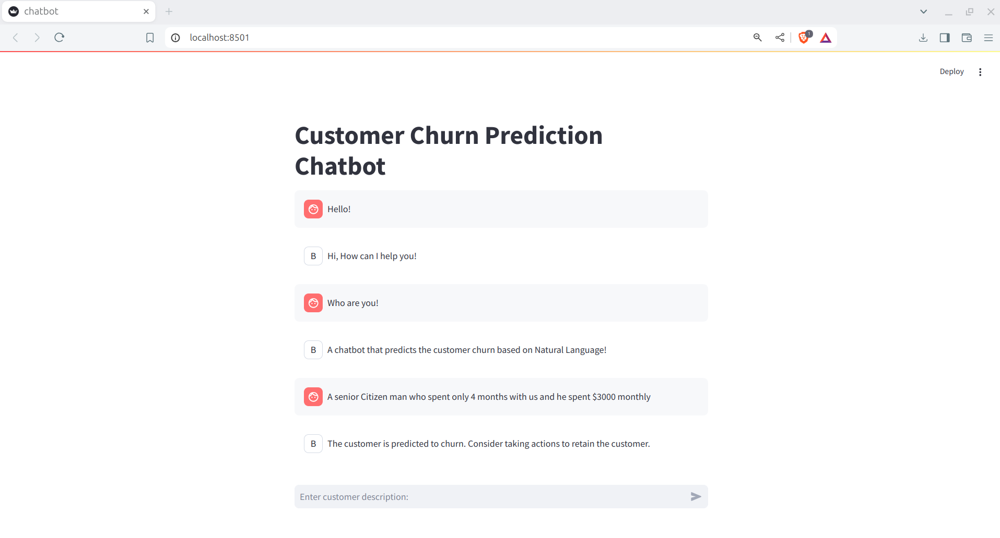

# Marketing Guru Chatbot

An AI-Powered Marketing Assistant for Churn Prediction



## Overview

The Marketing Guru Chatbot is designed to help businesses predict customer churn and interact with users through a chatbot interface. This repository contains scripts for preprocessing data, training a churn prediction model, testing the model, deploying an API, and creating a chatbot.

## Directory Structure

- `data/` - Contains the dataset used for training and testing.
- `model/` - Stores the trained model, label encoders, and scalers.
- `utils/` - Utility functions used throughout the project.
- `0-preprocess.py` - Script for preprocessing the data.
- `1-train.py` - Script for training the churn prediction model.
- `2-test.py` - Script for testing the trained model.
- `3-api.py` - FastAPI script to create an API for the churn prediction model.
- `4-chatbot.py` - Script to deploy a chatbot that uses the churn prediction API.
- `requirements.txt` - List of dependencies required for the project.

## Getting Started

### Prerequisites

Ensure you have Python installed on your system. You can install the required dependencies using:

```bash
pip install -r requirements.txt
```

### Data Preprocessing

Before training the model, preprocess the data using:

```bash
python 0-preprocess.py
```

This script will clean the data and prepare it for model training.

### Feature Selection, Encoding, and Scaling

#### Feature Selection

Feature selection involves selecting the most relevant features from the dataset to improve the performance of the model. In this project, feature selection is handled using:

- **Pandas**: For manipulating and selecting features.
- **Scikit-learn**: For feature selection techniques such as variance threshold, recursive feature elimination, etc.

#### Encoding

Encoding is the process of converting categorical variables into numerical values. In this project, encoding is done using:

- **Scikit-learn Labelencoder**: For label encoding of categorical features.

#### Scaling

Scaling is the process of normalizing the range of independent variables. In this project, scaling is performed using:

- **Scikit-learn StandardScaler**: For standard scaling to ensure all features contribute equally to the model.

### Training the Model

Train the churn prediction model (Logistic Regression) which beats Tree based models on this task with:

```bash
python 1-train.py
```

This script will train the model and save it along with label encoders and scalers in the `model/` directory.

### Testing the Model

Test the performance of the trained model using:

```bash
python 2-test.py
```

This script will evaluate the model on test data and print the performance metrics.

### Model Performance: Recall

The recall for the positive class (customers who are likely to churn) is 79%. Recall is a crucial metric in this context because it measures the ability of the model to identify actual churners. High recall means that most of the customers who will churn are correctly identified, which is vital for taking proactive measures to retain them.

#### Why Recall is Important

- **Customer Retention**: Identifying customers who are likely to churn allows businesses to intervene and potentially retain these customers through targeted marketing efforts.
- **Cost Efficiency**: The cost of retaining a customer is typically lower than acquiring a new one. High recall ensures that fewer churners are missed, reducing the overall cost of customer churn.
- **Business Strategy**: High recall provides actionable insights, allowing businesses to develop more effective strategies for customer retention and satisfaction.

### Deploying the API

Deploy the model as an API with FastAPI:

```bash
python 3-api.py
```

The API will be accessible at `http://127.0.0.1:8000`.

### Running the Streamlit Chatbot

Launch the chatbot interface using:

```bash
streamlit run 4-chatbot.py
```

The chatbot will interact with users and predict churn based on the model.

## Limitations

The current version of the Marketing Guru Chatbot is not designed for open-ended conversations. It takes a specific scenario as input, converts it to appropriate model inputs, and returns a prediction. The chatbot does not handle general conversational inputs well; messages like "Hi" or "Who are you" are hardcoded responses for now.

### Usage Advice

For the best experience, use the chatbot in a scenario-based manner: provide a specific customer scenario, and the chatbot will return the churn prediction. Future versions may include more advanced conversational capabilities.

## Contributing

Contributions are welcome. Please fork the repository and create a pull request.

## License

This project is licensed under the MIT License.